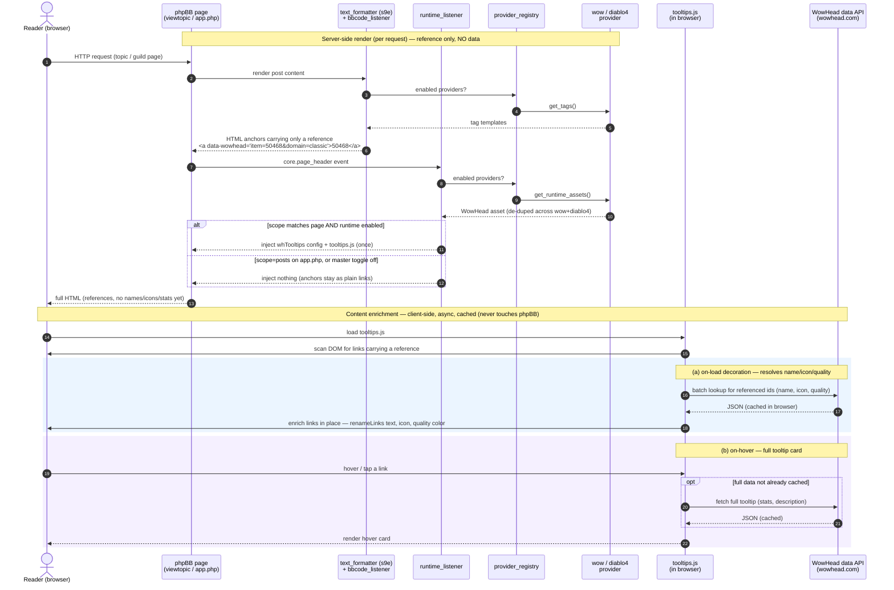

# bbTips 2.0 — Design Spec

**Date:** 2026-07-25
**Extension:** `avathar/bbtips` (phpBB 3.3 extension)
**Repo:** https://github.com/avatharbe/bbTips — new `main` branch; legacy `develop`/`master`/`v0xx` kept as archive.
**Status:** design approved in brainstorming; pending spec review.

## 1. Summary

bbTips is a **standalone** phpBB 3.3 extension that renders **game-data tooltips** for content written as
BBCodes in posts. It is built around a **game-provider abstraction**: the core owns the BBCode plumbing,
runtime-asset loading, ACP and the public API, while each *provider* defines its tags, link format, and the
client script(s) it needs.

**Providers in 2.0:**
- **World of Warcraft** (`wow`) — WowHead `tooltips.js` runtime; tags `item`, `spell`, `quest`, `achievement`,
  `npc`, `itemset`, `craft`, `itemico`.
- **Diablo 4** (`diablo4`) — the *same* WowHead `tooltips.js` runtime (D4 tooltips ride it via
  `wowhead.com/diablo-4/…` links); tags `d4item`, `d4skill`, etc.
- **Guild Wars 2** (`gw2`) — **planned follow-up**, not in 2.0. WowHead does not cover GW2, so it needs its own
  tooltip source (e.g. gw2treasures.com embed or the official GW2 API) and its own runtime asset.

It uses **official client-side tooltip runtimes** — no server-side scraping, no API keys, no cached tooltip data.
It also exposes a small public API so **bbGuild character pages can reuse the WoW provider's runtime and link
format** for equipped-gear popups, with **no hard dependency in either direction**.

### Relationship to the legacy MOD
The phpBB 3.0 MOD scraped WowHead HTML server-side (`simple_html_dom.php`, `wowhead_patterns.php`,
`bbtips_parser.php`), cached it in the DB (`dbal.php`), and rendered its own tooltip markup + `power.js`.
**That entire layer is dropped**, not ported — WowHead's modern embed replaces it and scraping is against ToS.

## 2. Scope

**Verification note (2026-07):** modern WowHead still supports the full legacy type set as embeddable
tooltips — *Achievements, Craftables, Enchants, Items, Item Icons, Item Sets, NPCs, Quests, Spells, Zones*
(Wowhead tooltips guide). So almost nothing is dropped for lack of support. What **changed** is *how* they're
embedded and which *game model* the old examples assumed — see §2.1.

**In scope (2.0):**
- **Provider abstraction** (`tooltip_provider_interface`, tagged services, registry) — the extensibility seam.
- **WoW provider:** tags `item`, `itemico` (icon), `spell`, `quest`, `craft` (recipe/craftable), `achievement`,
  `itemset`, `npc`; attributes `gems`, `ench`, `pcs`, `size`, `domain`; global game-version/domain default
  (retail / classic / ptr / de / ru / de.classic / …) + per-tag `domain=` override.
- **Diablo 4 provider:** tags for D4 items/skills (`d4item`, `d4skill`), emitting `wowhead.com/diablo-4/…`
  links; shares the WowHead runtime, so near-zero extra runtime cost.
- WowHead runtime loader (shared by wow + diablo4) with ACP scope setting (default: **all board pages**).
- Public link-helper service consumed optionally by bbGuild (WoW provider).
- ACP settings module (per-provider + per-tag toggles, display options, scope, WoW version, allowed group).
- Languages: en, de, fr, nl.

**Out of scope (2.0):** GW2 provider (planned follow-up), `[itemdkp]`, armory character tooltips, server-side
fetching/caching.

### 2.1 What the WowHead/WoW changes mean for us
*(Confirmed against wowhead.com/tooltips, 2026-07.)*
- **Script:** the old `power.js` / `$WowheadPower` API is retired. The modern embed is exactly:
  ```html
  <script>const whTooltips = {colorLinks: true, iconizeLinks: true, renameLinks: true};</script>
  <script src="https://wow.zamimg.com/js/tooltips.js"></script>
  ```
- **Numeric IDs are required — names no longer resolve.** The legacy MOD scraped WowHead by *name*
  (`[spell]Power Word: Shield[/spell]`). The modern embed resolves only by **entity ID**. So bbTips 2.0 tags
  take an ID: `[item]50468[/item]` or `[item=50468]optional label[/item]`. With `renameLinks:true`, WowHead
  replaces the visible text with the real name automatically, so `[item]50468[/item]` still shows "Ardent
  Guard". **This is the single biggest user-facing behavior change and must be called out in the README** — old
  name-based posts won't render tooltips.
- **Domain is a `data-wowhead=domain=` parameter, not a URL path.** Values: `classic`, `ptr`, `de`, `es`,
  `fr`, `ru`, `de.classic`, `ru.classic`, etc. Global default + per-tag `domain=` override map straight onto it.
- **`[craft]` loses its `mats` sub-argument.** Modern WowHead recipe/craftable tooltips show reagents natively;
  `[craft]` becomes a recipe link (`spell=`), and `[craft mats]…` is dropped.
- **Gems / enchants / tier-sets are a Classic-era concept.** Retail abandoned that gem-socket / enchant-ID /
  tier-set model. `gems=`/`ench=`/`pcs=` (colon-separated) still work but are meaningful mainly against
  **classic/wotlk/cata domains** — which is why the `domain` switch is load-bearing. Kept, documented as
  domain-dependent. (Retail-only extras like `transmog`, `ilvl`, `bonus`, `lvl` exist but are out of scope.)
- **Icons:** `iconizeLinks:true` shows icons on every link; per-link size via `data-wh-icon-size="small|medium|large"`
  (default `tiny`). `[itemico size=…]` maps to this attribute rather than being a distinct entity.

## 3. Architecture & components

Each component is independently understandable and testable.

### 3.0 Provider layer — `provider/` + registry
The extensibility seam. Mirrors the bbGuild game-plugin pattern.

- **`tooltip_provider_interface`** — each provider implements:
  - `get_id()` → `'wow'`, `'diablo4'`
  - `get_tags()` → the BBCode tag definitions it contributes (name, attributes, template callback)
  - `get_runtime_assets()` → the script/config it needs (URL + inline config), so the loader can de-dupe
  - `build_link($type, $id, $opts)` → anchor HTML (used by the linker service)
- **Providers ship in-tree:** `provider/wow_provider.php`, `provider/diablo4_provider.php`. Both return the
  **same** WowHead runtime asset, so the loader emits `tooltips.js` once for either/both.
- **Registry** — providers are tagged `bbtips.tooltip_provider` in `services.yml` and collected via phpBB's
  `phpbb\di\service_collection` (**not** Symfony `!tagged_iterator`, unsupported in 3.3). The registry exposes
  `get($id)`, `all()`, and `enabled()` (respecting ACP per-provider toggles).
- **Adding GW2 later** = one new provider class + its runtime asset + a services.yml tag. No core changes.

### 3.1 BBCode registration — `event/bbcode_listener.php`
Subscribes to `core.text_formatter_s9e_configure_after`. Iterates **enabled providers → their enabled tags**,
adding each as an s9e BBCode with its attributes and a template. WoW tags produce a WowHead anchor; the domain
is carried as a **`data-wowhead` parameter**, and the `href` may be any URL (custom hrefs are supported):

```
<a href="https://www.wowhead.com/item={id}"
   data-wowhead="item={id}&amp;domain={domain}&amp;ench={ench}&amp;gems={gems}&amp;pcs={pcs}">TEXT</a>
```

- `domain` resolves from the tag's `domain=` attribute, else the WoW provider's global config default
  (`''`/`www`, `classic`, `ptr`, `de`, `ru`, `de.classic`, …). It is a `data-wowhead` param — **not** a URL
  path segment.
- `type` maps per tag: `item`, `spell`, `quest`, `achievement`, `npc`, `item-set` (`itemset`), recipe `spell`
  (`craft`). `itemico` = an `item` link with `data-wh-icon-size` from the `size` attribute.
- `itemset` uses `pcs={ids}`; `gems`/`ench` apply to `item`/`itemico` (colon-separated, Classic-era-relevant).
- Diablo 4 tags emit `href="https://www.wowhead.com/diablo-4/…"` links (decorated by the same script).
- `TEXT` = tag content (or the id when empty; `renameLinks` fills the real name).
- Depends on: provider registry, config service. No DB, no network.

**Why s9e, not `bbcode.html`:** phpBB 3.3 replaced the old regex BBCode system with the s9e\TextFormatter
engine; custom tags with named attributes must be registered through the configurator event.

### 3.2 Runtime loader — `event/runtime_listener.php`
Subscribes to a page-render event (`core.page_header` or a template event in `overall_header`). Collects
`get_runtime_assets()` from all **enabled providers**, **de-dupes by URL**, and injects each unique asset once
per page. For wow + diablo4 that is a single WowHead block:
```html
<script>const whTooltips = { colorLinks:true, iconizeLinks:true, renameLinks:true };</script>
<script src="https://wow.zamimg.com/js/tooltips.js"></script>
```
- Options (`colorLinks`/`iconizeLinks`/`renameLinks`/`iconSize`) come from config.
- **Scope** config decides where it loads: `all` (default — includes `app.php`/bbGuild) or `posts`.
- A master "runtime enabled" toggle disables the third-party script(s) entirely (links still resolve as plain
  links).
- Depends on: provider registry, config service, template. No DB writes.

### 3.3 Link helper service — `avathar.bbtips.linker` (`services/linker.php`)
Public service + Twig helper other extensions call to emit correct anchors without knowing provider specifics.
Delegates to a provider's `build_link()`:
```php
$linker->wow()->item($id, ['ench' => 3825, 'gems' => [40133], 'domain' => 'classic']); // anchor HTML
$linker->for('diablo4')->item($id, [...]);
```
- **bbGuild integration:** on the character/player page, bbGuild renders each equipped item through the WoW
  provider via this service *iff* `avathar.bbtips.linker` exists in the container; otherwise it emits a plain
  link (graceful degradation). No composer dependency; detection via service existence.
- Depends on: provider registry, config service. Pure string building.

### 3.4 ACP module — `acp/bbtips_module.php` + `acp/bbtips_info.php`
Single settings page under a bbTips ACP category:
- **Per-provider enable** (wow, diablo4) and per-tag enable toggles within each.
- WoW game version/domain default (select).
- Display options: colorLinks, iconizeLinks, renameLinks, iconSize.
- Runtime scope (all / posts) and master runtime enable toggle.
- Minimum group/permission allowed to use the tags (optional; default: all posters).

### 3.5 Migrations — `migrations/`
- `install_bbtips.php`: adds config defaults (per-provider enable, per-tag enable = on, `bbtips_wow_domain = ''`,
  `bbtips_scope = all`, display flags, `bbtips_runtime_enabled = 1`), registers the ACP module.
- Single squashed base migration (matches bbGuild convention).

### 3.6 Scaffolding
`composer.json` (`avathar/bbtips`, type `phpbb-extension`), `ext.php`, `config/services.yml` (provider tags +
registry + linker + listeners), `provider/` (interface + wow + diablo4 + registry), `event/`, `acp/`,
`migrations/`, `language/{en,de,fr,nl}/`, `README.md`, `CHANGELOG.md`, `license.txt`. Requirements:
phpBB ≥ 3.3.0, PHP ≥ 8.1. EPV-clean; phpBB coding standards (tabs, Allman braces).

## 4. Data flow

```
Post / char-page HTML contains WowHead anchors  (from BBCode template OR linker service)
        │
        ▼
bbTips runtime loader emits tooltips.js + whTooltips config (per scope)
        │
        ▼
WowHead tooltips.js decorates anchors client-side → icons, quality colors, hover cards
```
No server-side network calls; no tooltip data stored.

### 4.1 Runtime sequence — post rendering + client decoration



**Enrichment, in words:** the server emits only a *reference* — an entity id (+ optional domain/gems/ench).
The actual data (name, icon, quality color, stats) is resolved **in the browser by WowHead's `tooltips.js`**, in
two async passes: **(a)** shortly after load it batch-resolves the visible links to apply `renameLinks`/icons/
colors, and **(b)** on hover it renders the full card (reusing cached data, or fetching detail if needed).
Results are cached client-side. **No enrichment data flows through phpBB or bbTips** — which is exactly why the
legacy server-side scrape-and-cache layer is gone.

### 4.2 Runtime sequence — bbGuild character page (optional consumer)

```mermaid
sequenceDiagram
    autonumber
    participant BG as bbGuild<br/>character page
    participant Cont as service container
    participant Link as avathar.bbtips.linker
    participant Prov as wow_provider
    participant RL as bbTips runtime_listener

    Note over BG,Prov: Server-side render
    BG->>Cont: has 'avathar.bbtips.linker'?
    alt bbTips installed
        Cont-->>BG: linker service
        loop each equipped item
            BG->>Link: wow()->item(id, {ench, gems, domain})
            Link->>Prov: build_link('item', id, opts)
            Prov-->>BG: <a data-wowhead="…"> anchor
        end
        Note over RL: with scope=all, runtime_listener already<br/>emitted tooltips.js on this app.php page
    else bbTips absent
        Cont-->>BG: (service not defined)
        BG->>BG: render plain <a> link (graceful degradation)
    end
```

No server-side network calls in either path; no tooltip data stored. All tooltip fetching is client-side by
WowHead's script.

## 5. Privacy / GDPR

`tooltips.js` is a third-party asset (WowHead / Zam CDN). Documented in README and the ACP page. The master
runtime toggle allows disabling it (links degrade to plain WowHead hyperlinks). No user data is sent beyond the
standard asset request the browser makes.

## 6. Testing

- **Provider registry:** returns enabled providers/tags; per-provider ACP toggle removes a provider's tags.
- **BBCode output:** each enabled tag renders the expected anchor (via the text_formatter service); disabled
  tags render as literal text. WoW `domain=` override and global default both reflected in `data-wowhead`.
- **Attributes:** `gems`/`ench`/`pcs`/`size` map into `data-wowhead` / `data-wh-icon-size` correctly.
- **Diablo 4:** `d4item` emits a `wowhead.com/diablo-4/…` anchor.
- **Runtime scope & de-dupe:** one WowHead block emitted with wow+diablo4 both enabled; present on `app.php`
  only under scope `all`; absent under master toggle off (anchors still present).
- **bbGuild bridge:** linker `wow()->item()` returns correct anchors; bbGuild char page decorates when bbTips
  present, degrades to plain links when absent.
- **Migration:** clean install creates config + ACP module; uninstall reverts.

## 7. Open items / follow-ups (post-2.0)
- **GW2 provider** — needs a non-WowHead tooltip source (gw2treasures.com embed or official GW2 API) and its
  own runtime asset; slots in as one provider class + services.yml tag, no core changes.
- `[itemdkp]` equivalent once a DKP consumer exists.
- Optional server-side name/icon resolution (hybrid) if third-party-script-free rendering is later required.
